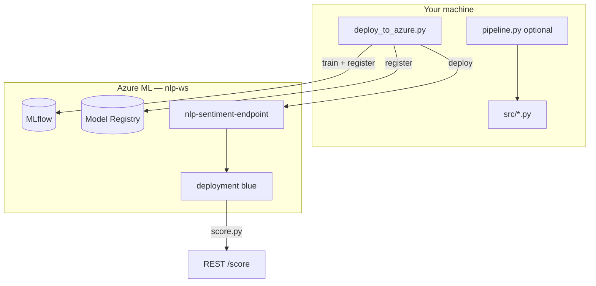
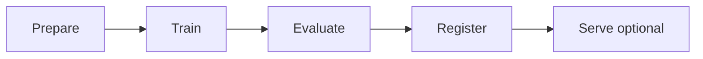
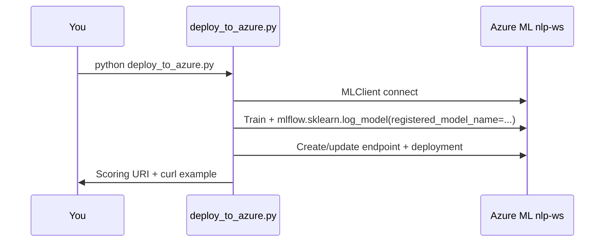

# Simple NLP Pipeline — Project Flow

How the project works: **local development** and **Azure ML model deployment** (no CI/CD).

---

## Table of contents

1. [Overview](#1-overview)
2. [Architecture](#2-architecture)
3. [Repository structure](#3-repository-structure)
4. [The model & data](#4-the-model--data)
5. [Local pipeline](#5-local-pipeline)
6. [Azure deployment](#6-azure-deployment)
7. [Live endpoint](#7-live-endpoint)
8. [Configuration](#8-configuration)
9. [Troubleshooting](#9-troubleshooting)

---

## 1. Overview

| Capability | Implementation |
|------------|----------------|
| Data (local) | Hugging Face `stanfordnlp/imdb` → CSV |
| Data (Azure deploy script) | Built-in sample texts (notebook-style) |
| Model | TF-IDF + Logistic Regression |
| Tracking | MLflow (workspace URI when on Azure) |
| **Production** | `deploy_to_azure.py` → managed online endpoint |
| Local API | `serve/serve.py` (FastAPI) |

**Two paths:**

1. **Azure (primary)** — `python deploy_to_azure.py`
2. **Local (optional)** — `python pipeline.py`

---

## 2. Architecture



---

## 3. Repository structure

```
simple_nlp_pipeline/
├── deploy_to_azure.py       # ★ Train → register → deploy
├── pipeline.py              # Local stages 1–5
├── src/
│   ├── prepare_data.py      # IMDB → CSV
│   ├── train.py
│   ├── evaluate.py
│   ├── register.py
│   └── score.py             # Endpoint inference
├── training/
│   ├── online_endpoint.yml  # Optional CLI create
│   └── online_deployment.yml
├── conda.yaml               # Endpoint environment
├── serve/serve.py           # Local FastAPI
└── data/                    # train.csv, test.csv
```

---

## 4. The model & data

### Model

```text
text → TfidfVectorizer → LogisticRegression → label (positive / negative / neutral)
```

### Local data (`prepare_data.py`)

- Source: `load_dataset("stanfordnlp/imdb")`
- Output: `data/train.csv`, `data/test.csv`

### Azure deploy script data

`deploy_to_azure.py` uses the same **25-sample** dataset as `nlp_train_register.ipynb` (not IMDB).

---

## 5. Local pipeline



| Stage | Script | Output |
|-------|--------|--------|
| 1 | `src/prepare_data.py` | `data/*.csv` |
| 2 | `src/train.py` | `train/model.pkl`, MLflow run |
| 3 | `src/evaluate.py` | metrics, quality gate ≥ 0.85 |
| 4 | `src/register.py` | MLflow registry |
| 5 | `serve/serve.py` | `http://localhost:8000` |

```powershell
python pipeline.py --no-serve
```

---

## 6. Azure deployment

### `deploy_to_azure.py` flow



| Step | What happens |
|------|----------------|
| Connect | `MLClient` → workspace `nlp-ws`, RG `nlp-new-rg` |
| MLflow | `mlflow.set_tracking_uri(workspace.mlflow_tracking_uri)` |
| Train | Notebook-style sample data, TF-IDF + LogReg |
| Register | `registered_model_name=nlp-sentiment-model` |
| Deploy | Managed endpoint `nlp-sentiment-endpoint`, deployment `blue` |
| Traffic | 100% to `blue` |

**Flags:**

- `--skip-train` — deploy latest registered version only

**Duration:** first deploy ~10–20 minutes.

### Scoring on the endpoint

`src/score.py` is packaged with the deployment. Request body:

```json
{ "text": "I love this product!" }
```

or

```json
{ "inputs": ["Great!", "Terrible."] }
```

---

## 7. Live endpoint

| Item | Value |
|------|--------|
| **Scoring URL** | https://nlp-ws-oiynf.eastus.inference.ml.azure.com/score |
| **Auth** | Bearer token (primary key from Studio → Consume) |
| **Workspace** | `nlp-ws` |
| **Endpoint name** | `nlp-sentiment-endpoint` |

---

## 8. Configuration

### `deploy_to_azure.py`

| Setting | Default |
|---------|---------|
| `RESOURCE_GROUP` | `nlp-new-rg` |
| `WORKSPACE_NAME` | `nlp-ws` |
| `MODEL_NAME` | `nlp-sentiment-model` |
| `ENDPOINT_NAME` | `nlp-sentiment-endpoint` |
| `DEPLOYMENT_NAME` | `blue` |

### Local `pipeline.py`

| Setting | Default |
|---------|---------|
| Train/test size | 5000 / 1000 |
| Experiment | `sentiment_analysis` |
| Quality gate | accuracy & F1 ≥ 0.85 |

---

## 9. Troubleshooting

| Issue | Fix |
|-------|-----|
| `load_dataset("imdb")` fails | Use `stanfordnlp/imdb` in `prepare_data.py` |
| Auth errors | Run `az login` or allow browser credential in script |
| Deploy slow | Normal; wait for endpoint provisioning |
| 401 on `/score` | Use correct primary key in `Authorization: Bearer` |
| Quality gate fails (local) | Lower `--min-accuracy` or improve data |

---

## Summary

| Goal | Command |
|------|---------|
| **Deploy to Azure** | `python deploy_to_azure.py` |
| Redeploy only | `python deploy_to_azure.py --skip-train` |
| Local experiments | `python pipeline.py --no-serve` |
| Call production API | POST to [scoring URL](https://nlp-ws-oiynf.eastus.inference.ml.azure.com/score) with endpoint key |
