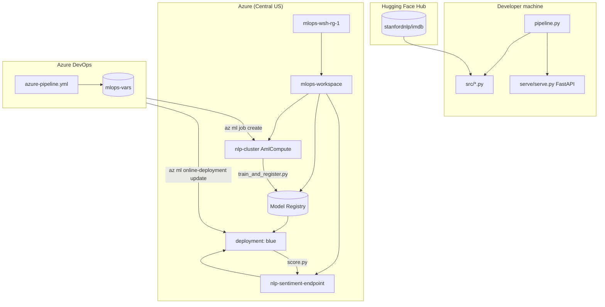
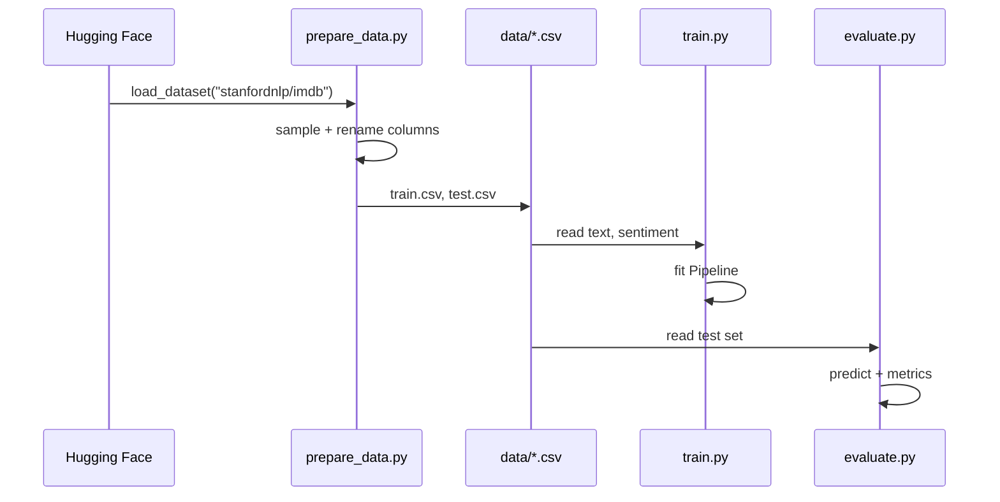
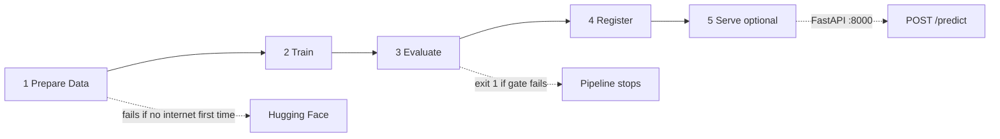
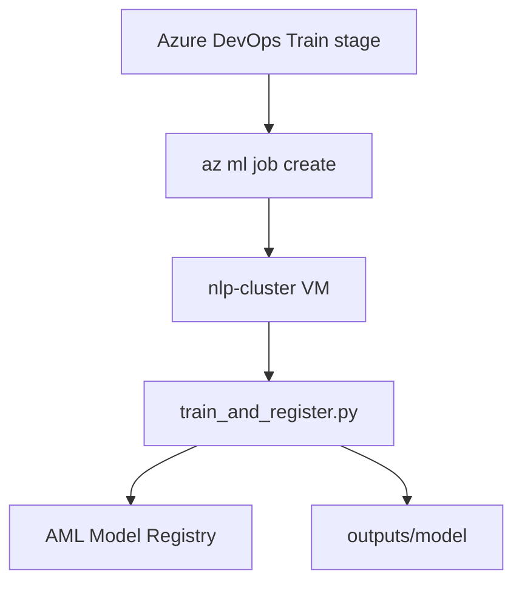
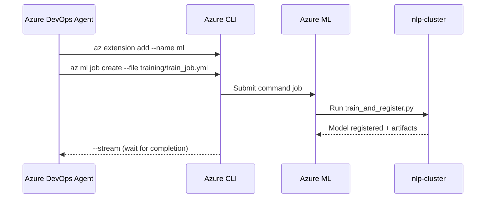
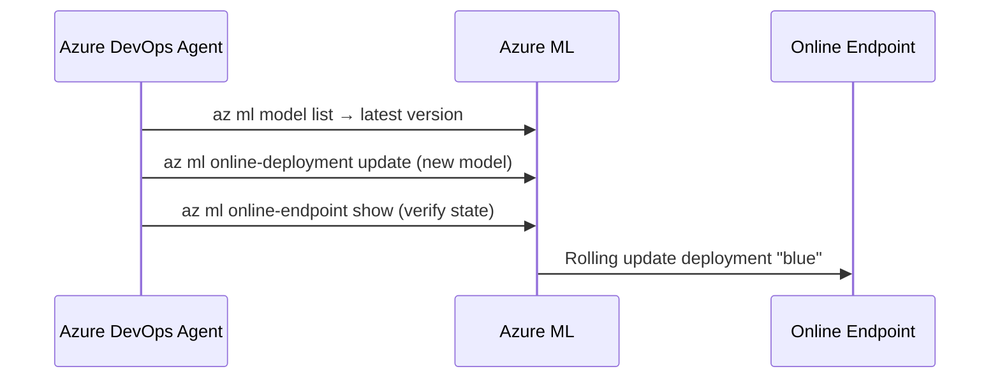
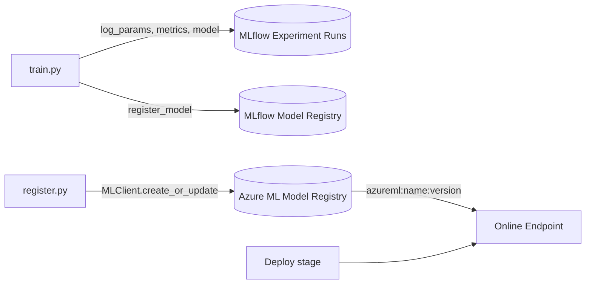

# Simple NLP Pipeline — Complete Project Flow

This document explains **what the project does**, **how each component fits together**, and **how both the local pipeline and the Azure DevOps / Azure ML pipeline work** end to end.

---

## Table of contents

1. [Project overview](#1-project-overview)
2. [High-level architecture](#2-high-level-architecture)
3. [Repository structure](#3-repository-structure)
4. [The ML problem](#4-the-ml-problem)
5. [Data flow](#5-data-flow)
6. [The model](#6-the-model)
7. [Local pipeline (`pipeline.py`)](#7-local-pipeline-pipelinepy)
8. [Azure ML training job](#8-azure-ml-training-job)
9. [Azure DevOps CI/CD (`azure-pipeline.yml`)](#9-azure-devops-cicd-azure-pipelineyml)
10. [Managed online endpoint](#10-managed-online-endpoint)
11. [MLflow tracking and registries](#11-mlflow-tracking-and-registries)
12. [Configuration reference](#12-configuration-reference)
13. [Prerequisites and one-time setup](#13-prerequisites-and-one-time-setup)
14. [Command cheat sheet](#14-command-cheat-sheet)
15. [Troubleshooting](#15-troubleshooting)

---

## 1. Project overview

**Goal:** Build a **movie-review sentiment classifier** (positive vs negative) and run it through a small **MLOps workflow**:

| Capability | How it is implemented |
|------------|------------------------|
| Data | IMDB reviews from Hugging Face |
| Training | scikit-learn (TF-IDF + Logistic Regression) |
| Experiment tracking | MLflow |
| Cloud training | Azure ML compute cluster `nlp-cluster` |
| CI/CD | Azure DevOps (`azure-pipeline.yml`) |
| Production inference | Azure ML **managed online endpoint** |
| Local dev / demo API | FastAPI (`serve/serve.py`) |

There are **two ways** to run the same logic:

1. **Local** — `python pipeline.py` runs stages on your machine.
2. **Cloud** — push to `main` → Azure DevOps submits an AML job → deploys the new model to an endpoint.

All core logic lives in **`src/`**. Folders like `data/`, `train/`, `evaluate/`, and `register/` are thin wrappers for backward compatibility.

---

## 2. High-level architecture



**Local path:** IMDB → CSV → train → evaluate → register (MLflow) → optional FastAPI.

**Cloud path:** ADO triggers → AML job on `nlp-cluster` → register model in workspace → ADO updates endpoint deployment.

---

## 3. Repository structure

```
simple_nlp_pipeline/
│
├── flow.md                    ← This document
├── pipeline.py                ← Local orchestrator (stages 1–5)
├── azure-pipeline.yml         ← Azure DevOps CI/CD definition
├── conda.yaml                 ← Python env for AML jobs & deployments
├── requirements.txt           ← Local pip dependencies
├── commands.txt               ← Copy-paste Azure CLI commands
│
├── src/                       ← ★ Canonical source code
│   ├── config.py              ← Paths, env defaults
│   ├── prepare_data.py        ← Stage 1: download IMDB → CSV
│   ├── train.py               ← Stage 2: fit model + MLflow log
│   ├── evaluate.py            ← Stage 3: test metrics + quality gate
│   ├── register.py            ← Stage 4: MLflow + Azure ML model registry
│   ├── train_and_register.py  ← Azure job entry (runs all 4 stages)
│   └── score.py               ← Azure endpoint scoring script
│
├── training/                  ← Azure ML YAML definitions
│   ├── train_job.yml          ← Command job (compute: nlp-cluster)
│   ├── online_endpoint.yml    ← One-time endpoint create
│   └── online_deployment.yml← One-time deployment create
│
├── data/                      ← Generated CSVs (gitignore recommended)
│   ├── prepare_data.py        ← Wrapper → src/prepare_data.py
│   ├── train.csv
│   └── test.csv
│
├── train/
│   ├── train.py               ← Wrapper → src/train.py
│   └── model.pkl              ← Pickled sklearn Pipeline (after train)
│
├── evaluate/
│   ├── evaluate.py            ← Wrapper → src/evaluate.py
│   └── eval_report.json       ← Metrics JSON (after evaluate)
│
├── register/
│   └── register.py            ← Wrapper → src/register.py
│
├── serve/
│   └── serve.py               ← Local FastAPI (stage 5)
│
└── mlruns/                    ← Local MLflow store (if tracking locally)
```

---

## 4. The ML problem

| Item | Detail |
|------|--------|
| **Task** | Binary text classification |
| **Input** | Movie review text (string) |
| **Output** | `positive` or `negative` (+ confidence) |
| **Dataset** | [IMDB](https://huggingface.co/datasets/stanfordnlp/imdb) — 25k train / 25k test reviews |
| **Sampling** | Default 5,000 train + 1,000 test rows (configurable) for faster runs |

Labels: `0` = negative, `1` = positive.

---

## 5. Data flow



### Stage 1 — `src/prepare_data.py`

1. Calls `load_dataset("stanfordnlp/imdb")` via the **`datasets`** library (not sklearn).
2. Randomly samples `train_size` / `test_size` rows (default 5000 / 1000).
3. Writes:

| File | Columns |
|------|---------|
| `data/train.csv` | `text`, `sentiment`, `sentiment_label` |
| `data/test.csv` | same |

> **Note:** Use the full Hub id `stanfordnlp/imdb`. Bare `"imdb"` fails on newer `huggingface_hub` versions.

First download is cached under `~/.cache/huggingface/`.

---

## 6. The model

### Algorithm

A **scikit-learn `Pipeline`** with two steps:

```text
Review text  →  TfidfVectorizer  →  sparse features  →  LogisticRegression  →  0 or 1
```

| Component | Role | Key settings |
|-----------|------|----------------|
| `TfidfVectorizer` | Word n-grams → TF-IDF weights | `max_features=30000`, `ngram_range=(1,2)` |
| `LogisticRegression` | Linear classifier | `C=1.0`, `solver=lbfgs` |

This is a **simple, interpretable baseline** — not a deep learning model. It trains in seconds on a CPU.

### Artifacts produced by training

| Artifact | Location | Used by |
|----------|----------|---------|
| Pickled pipeline | `train/model.pkl` | evaluate, serve (local) |
| MLflow model | MLflow run `artifacts/model/` | register, AML |
| MLflow package on disk | `outputs/model/` (Azure job) | AML model registry, endpoint |

---

## 7. Local pipeline (`pipeline.py`)



### How `pipeline.py` works

`pipeline.py` does **not** contain ML logic. It runs each `src/*.py` script as a subprocess and **stops on first failure**.

```bash
python pipeline.py              # Full run + start FastAPI
python pipeline.py --no-serve   # Stages 1–4 only (CI-style)
```

### Stage-by-stage detail

#### Stage 1 — Prepare data

- **Script:** `src/prepare_data.py`
- **Output:** `data/train.csv`, `data/test.csv`

#### Stage 2 — Train

- **Script:** `src/train.py`
- **Actions:**
  - Starts an MLflow run in experiment `sentiment_analysis`
  - Logs hyperparameters and training metrics (`train_accuracy`, `train_f1`)
  - Saves `train/model.pkl`
  - Calls `mlflow.sklearn.log_model(...)` under artifact path `model`

#### Stage 3 — Evaluate (quality gate)

- **Script:** `src/evaluate.py`
- **Actions:**
  - Loads `train/model.pkl` and `data/test.csv`
  - Computes test metrics: accuracy, F1, precision, recall, ROC-AUC
  - Logs metrics to the **latest MLflow run**
  - Writes `evaluate/eval_report.json`
- **Quality gate (default):**
  - `test_accuracy >= 0.85`
  - `test_f1 >= 0.85`
  - If either fails → **`sys.exit(1)`** → pipeline aborts before register/deploy

#### Stage 4 — Register

- **Script:** `src/register.py`
- **Actions:**
  1. Finds the latest MLflow run in the experiment
  2. `mlflow.register_model(...)` → **MLflow Model Registry** (`sentiment_classifier`)
  3. Saves an MLflow sklearn package to `outputs/model/` (or `MODEL_OUTPUT_DIR`)
  4. If Azure env vars are present → **`azure.ai.ml`** registers model in **AML workspace model registry** (used by `az ml model list`)

#### Stage 5 — Serve (optional)

- **App:** `serve/serve.py` (FastAPI + uvicorn)
- **Loads:** `train/model.pkl`
- **Endpoints:**

| Method | Path | Purpose |
|--------|------|---------|
| GET | `/health` | Liveness |
| GET | `/model-info` | Metadata |
| POST | `/predict` | Single review |
| POST | `/predict/batch` | Multiple reviews |
| GET | `/docs` | Swagger UI |

Example request:

```json
POST /predict
{ "text": "This movie was absolutely fantastic!" }
```

Example response:

```json
{
  "text": "This movie was absolutely fantastic!",
  "label": "positive",
  "confidence": 0.92
}
```

---

## 8. Azure ML training job

Defined in **`training/train_job.yml`**. Submitted by Azure DevOps or manually:

```bash
az ml job create \
  --file training/train_job.yml \
  --resource-group mlops-wsh-rg-1 \
  --workspace-name mlops-workspace \
  --stream
```

### What the job YAML specifies

| Field | Value | Meaning |
|-------|-------|---------|
| `code` | `../src` | Uploads `src/` folder to the job |
| `command` | `python train_and_register.py ...` | Entry script |
| `compute` | `azureml:nlp-cluster` | Runs on your AmlCompute cluster |
| `environment` | `conda.yaml` + Azure ML base image | Installs Python deps |
| `outputs.model_output` | `outputs/model` | Uploaded artifact folder after job |

### What runs on the cluster — `src/train_and_register.py`

Single script that chains the same four stages as local `pipeline.py`:

```text
prepare_data  →  train  →  evaluate  →  register
```

On Azure ML:

- MLflow automatically tracks to the **workspace** (when `azureml-mlflow` is installed).
- `register.py` calls **`MLClient.models.create_or_update()`** so the model appears as `sentiment_classifier` in the **AML model registry**.
- Job output `outputs/model/` contains the MLflow model package (`MLmodel`, `conda.yaml`, etc.).



---

## 9. Azure DevOps CI/CD (`azure-pipeline.yml`)

### Trigger

Runs when you push to **`main`** and change:

- `src/*`
- `training/*`
- `conda.yaml`

### Variable group `mlops-vars`

Create in Azure DevOps → Pipelines → Library:

| Variable | Example value |
|----------|----------------|
| `RESOURCE_GROUP` | `mlops-wsh-rg-1` |
| `AML_WORKSPACE` | `mlops-workspace` |
| `MODEL_NAME` | `sentiment_classifier` |
| `ENDPOINT_NAME` | `nlp-sentiment-endpoint` |
| `DEPLOYMENT_NAME` | `blue` |

Also configure service connection: **`azure-service-connection`**.

### Stage 1 — Train



1. Install Azure ML CLI extension.
2. Submit `training/train_job.yml` with `--stream` (waits until the job finishes).
3. On success, a new model version exists in the workspace registry.

### Stage 2 — Deploy

Runs only if **Train** succeeded (`dependsOn: Train`, `condition: succeeded()`).



1. Query latest version of `$(MODEL_NAME)`.
2. Update deployment `$(DEPLOYMENT_NAME)` on endpoint `$(ENDPOINT_NAME)`:

   ```bash
   --set model=azureml:sentiment_classifier:<VERSION>
   ```

3. Verify endpoint `provisioning_state`.

> **Important:** The endpoint and deployment must exist **before** the first pipeline deploy. See [one-time setup](#13-prerequisites-and-one-time-setup).

### Full CI/CD timeline

```text
git push (main)
    │
    ▼
┌─────────────────────────────────────┐
│  Stage: Train                       │
│  • Submit AML job on nlp-cluster    │
│  • prepare → train → eval → register│
└─────────────────────────────────────┘
    │ succeeded()
    ▼
┌─────────────────────────────────────┐
│  Stage: Deploy                      │
│  • Get latest model version         │
│  • Update online deployment         │
│  • Verify endpoint is live          │
└─────────────────────────────────────┘
    │
    ▼
Production REST API (Azure ML endpoint)
```

---

## 10. Managed online endpoint

### Components

| Resource | Name (default) | Purpose |
|----------|----------------|---------|
| Online endpoint | `nlp-sentiment-endpoint` | Public URL + auth key |
| Deployment | `blue` | Runs the model (can add `green` for blue/green) |
| Scoring script | `src/score.py` | Loads model, runs inference |

### `src/score.py` (cloud inference)

Azure ML calls:

1. **`init()`** — loads sklearn model from `AZUREML_MODEL_DIR`
2. **`run(raw_data)`** — parses JSON, returns predictions

Request format:

```json
{ "inputs": ["Great movie!", "Terrible film."] }
```

or single text:

```json
{ "text": "I loved it!" }
```

Response:

```json
{
  "predictions": [
    { "text": "Great movie!", "label": "positive", "confidence": 0.91 },
    { "text": "Terrible film.", "label": "negative", "confidence": 0.88 }
  ]
}
```

### Local FastAPI vs Azure endpoint

| | Local `serve/serve.py` | Azure `score.py` |
|--|------------------------|------------------|
| Framework | FastAPI | AML managed scoring |
| Model load | `train/model.pkl` | MLflow package in `AZUREML_MODEL_DIR` |
| URL | `http://localhost:8000` | Workspace endpoint URL + key |
| Used by | `pipeline.py` stage 5 | Production / CI deploy stage |

---

## 11. MLflow tracking and registries

This project uses **two related but different** “registries”:



| Store | What it holds | Where you see it |
|-------|---------------|------------------|
| **MLflow experiment** | Runs, metrics, artifacts | `mlruns/` locally; Azure ML MLflow tab in cloud |
| **MLflow Model Registry** | Registered model versions, stages | MLflow UI |
| **Azure ML Model Registry** | `sentiment_classifier` assets | `az ml model list`; Deploy stage reads this |

The **Deploy stage** uses **`az ml model list`**, so `register.py` must register via **`azure.ai.ml`** on the training job (not only local MLflow file store).

---

## 12. Configuration reference

### Environment variables (`src/config.py`)

| Variable | Default | Used when |
|----------|---------|-----------|
| `MODEL_NAME` | `sentiment_classifier` | Register + AML |
| `EXPERIMENT_NAME` | `sentiment_analysis` | MLflow experiment |
| `MIN_ACCURACY` | `0.85` | Quality gate |
| `MIN_F1` | `0.85` | Quality gate |
| `DATA_DIR` | `data/` | Override data path |
| `AZUREML_OUTPUT_model_output` | Set by AML job | Job output folder |
| `AZUREML_ARM_*` | Set by AML job | Workspace identity for `MLClient` |

### Training hyperparameters (`pipeline.py` / `train.py`)

| CLI flag | Default |
|----------|---------|
| `--train-size` | 5000 |
| `--test-size` | 1000 |
| `--max-features` | 30000 |
| `--ngram-max` | 2 |
| `--C` | 1.0 |
| `--min-accuracy` | 0.85 |
| `--min-f1` | 0.85 |

### Azure resources (from `commands.txt`)

| Resource | Value |
|----------|-------|
| Resource group | `mlops-wsh-rg-1` |
| Region | `centralus` |
| Workspace | `mlops-workspace` |
| Compute cluster | `nlp-cluster` |
| Endpoint | `nlp-sentiment-endpoint` |
| Deployment | `blue` |

---

## 13. Prerequisites and one-time setup

### Local development

```bash
cd simple_nlp_pipeline
python -m venv .venv
.venv\Scripts\activate          # Windows
pip install -r requirements.txt
python pipeline.py --no-serve
```

### Azure (one-time)

1. **Resource group + workspace** (already created in your subscription).
2. **Compute cluster:**

   ```bash
   az ml compute create --name nlp-cluster --type AmlCompute \
     --size Standard_DS3_v2 --min-instances 0 --max-instances 2 \
     -g mlops-wsh-rg-1 -w mlops-workspace
   ```

3. **Online endpoint + deployment** (before first CI deploy):

   ```bash
   az ml online-endpoint create -f training/online_endpoint.yml \
     -g mlops-wsh-rg-1 -w mlops-workspace

   az ml online-deployment create -f training/online_deployment.yml \
     -g mlops-wsh-rg-1 -w mlops-workspace --all-traffic
   ```

4. **Azure DevOps**
   - Service connection `azure-service-connection`
   - Variable group `mlops-vars` with names from [section 12](#12-configuration-reference)
   - Pipeline pointing at `azure-pipeline.yml`

### Order of operations (first time)

```text
1. Create workspace + nlp-cluster
2. Run training job once (manual or pipeline Train stage)
3. Create endpoint + deployment
4. Enable azure-pipeline.yml on main branch
5. Future pushes → auto train + deploy
```

---

## 14. Command cheat sheet

| Goal | Command |
|------|---------|
| Full local pipeline | `python pipeline.py` |
| Local without API | `python pipeline.py --no-serve` |
| Prepare data only | `python src/prepare_data.py` |
| Submit AML training job | `az ml job create -f training/train_job.yml -g mlops-wsh-rg-1 -w mlops-workspace --stream` |
| List model versions | `az ml model list --name sentiment_classifier -g mlops-wsh-rg-1 -w mlops-workspace -o table` |
| Update deployment | See `commands.txt` |
| Local API docs | `http://localhost:8000/docs` after `pipeline.py` |

---

## 15. Troubleshooting

| Symptom | Likely cause | Fix |
|---------|--------------|-----|
| `HfUriError` on `load_dataset("imdb")` | Old dataset id | Use `stanfordnlp/imdb` (already fixed in `prepare_data.py`) |
| `train.csv not found` | Skipped stage 1 | Run `prepare_data.py` or full `pipeline.py` |
| Pipeline stops at evaluate | Quality gate failed | Improve model or lower `--min-accuracy` / `--min-f1` |
| Deploy stage: no model found | Train job didn’t register AML model | Check job logs; ensure `azure-ai-ml` in `conda.yaml` |
| Deploy stage: endpoint not found | One-time setup skipped | Run `online_endpoint.yml` + `online_deployment.yml` |
| `nlp-cluster` not starting | Min instances 0 | Cluster scales up on job submit (may take a few minutes) |
| Symlink warning (Windows) | HF cache on Windows | Harmless; set `HF_HUB_DISABLE_SYMLINKS_WARNING=1` |

---

## Summary

| Path | Flow |
|------|------|
| **Local** | Hugging Face IMDB → CSV → sklearn train → evaluate gate → MLflow register → optional FastAPI |
| **Azure ML job** | Same four stages on `nlp-cluster` → AML model registry + `outputs/model` |
| **Azure DevOps** | Push to `main` → submit job → on success update `blue` deployment on `nlp-sentiment-endpoint` |

The project is intentionally **simple** (TF-IDF + logistic regression) so you can focus on the **MLOps plumbing**: data prep, training, gating, registration, CI/CD, and managed inference in Azure.
